<h1 align="center">Hi 👋, I'm Sai Ashwatha Singari</h1>

<h3 align="center">B.Tech (Computer & Communication Engineering) student @ Manipal Institute of Technology — CGPA 8.71</h3>

  

  
  

---

## 🎓 Education

**Manipal Institute of Technology, Manipal, India** · *July 2023 – July 2027*
B.Tech., Computer and Communication Engineering — **CGPA: 8.71 / 10**

> 📚 Coursework: Data Structures & Algorithms · Object Oriented Programming · Database Management Systems · Computer Networks · Embedded Systems · Operating Systems

---

## 💼 Experience

  
  &nbsp;&nbsp;&nbsp;
  

### Software Engineering Intern — NI (National Instruments), now part of Emerson
*Jul 2026 – Jun 2027*

- 🔧 Developing high-performance **C++ APIs and hardware drivers** for RF Signal Acquisition (RFSA) and RF Signal Generation (RFSG) instruments, enabling compatibility with **LabVIEW**, NI software, and third-party applications
- 🏗️ Building and maintaining **production-grade software** — implementing new features, debugging complex issues, validating hardware-software interactions, and optimizing reliability across RF measurement systems
- 🤝 Collaborating with cross-functional **RF R&D engineers** to design, test, and deliver robust engineering solutions following industry-standard development and version control practices

---

## 🚀 Projects

### 🛡️ Sentinel — Encrypted Traffic Threat-Intelligence Engine
`C++17` `Python` `Node.js` `Docker`

- Multithreaded **C++17 deep packet inspection engine** with a lock-free worker pool parsing Ethernet/IP/TCP/UDP traffic at **~247K packets/sec**
- **JA3 TLS fingerprinting** with real-time threat detectors for port scanning, DNS tunnelling, C2 beaconing, SYN floods, and cleartext credential exposure using flow-based analysis
- **Random Forest** encrypted traffic classifier with structured telemetry, real-time **WebSocket dashboard**, Docker, GitHub Actions CI, and unit tests

### 📄 CVision — AI-powered Resume Builder
`MongoDB` `Express.js` `React` `Node.js` `LangChain`

- High-performance editor with **real-time side-by-side previewing** and section-wise editing across multiple **ATS-optimized themes**
- **LangChain**-powered AI content generation and **ImageKit** automated background removal, reducing resume creation time
- Automated resume parsing for instant data import and **high-fidelity PDF export** with consistent formatting retention

---

## 🛠️ Tech Stack

**Languages**

  

**Frameworks & Libraries**

  
  
  

**Tools & Platforms**

  
  
  

---

## 📊 GitHub Stats

  
  

  

  

---

## 🧩 LeetCode

  

---

## 📬 Contact

  
  

---

 

  

  

